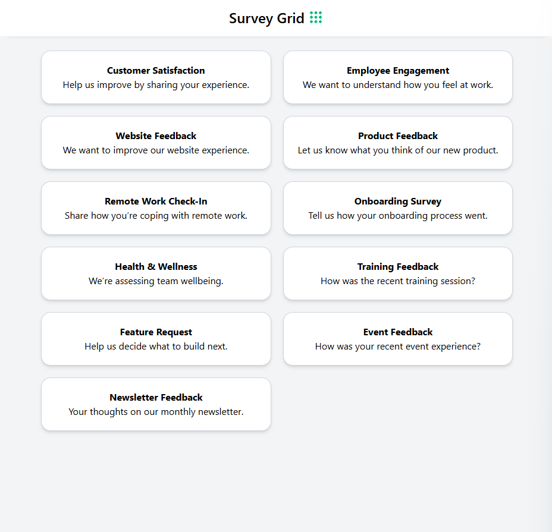
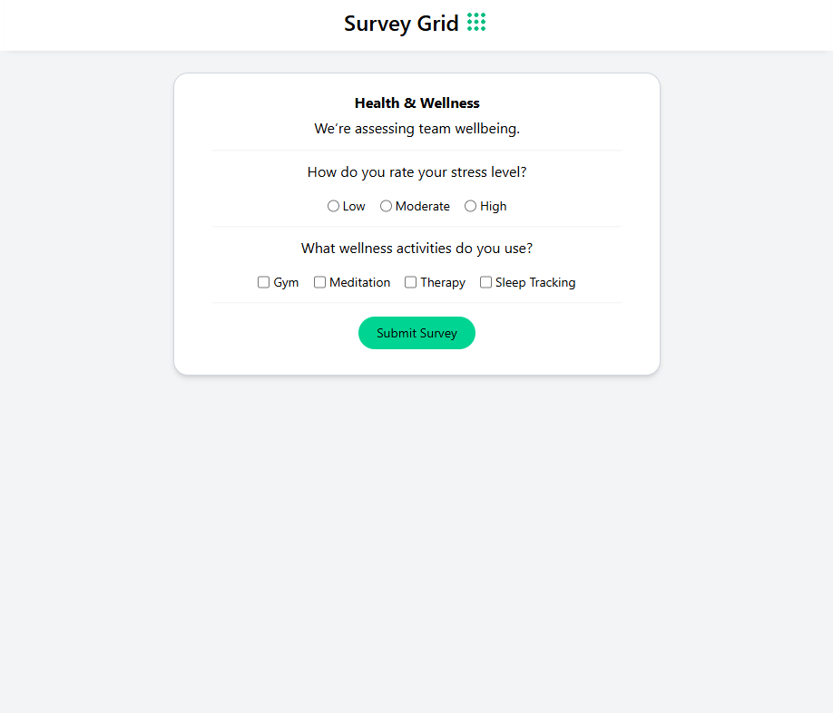
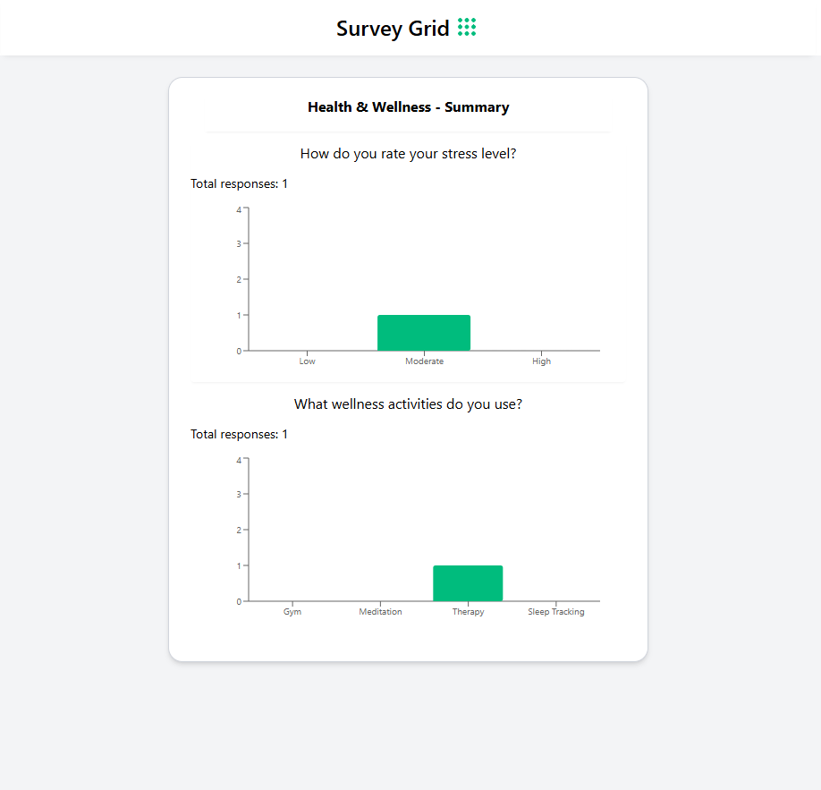

# Survey Grid – Lightweight Survey Tool

A modern, responsive survey application built with **Vite + React + TypeScript**. It allows users to browse surveys, take a survey, submit responses, and view aggregated results with a clean, mobile-friendly UI and a real API backend.

---

## 🚀 Features

- View a list of available surveys
- Take surveys with single and multiple choice questions
- Submit responses to an API endpoint
- View survey summaries with charts (Recharts)
- Mobile responsive, animated UI
- Error handling and loading states
- Token-based authorisation

---

## 🧩 Tech Stack

| Tool             | Purpose                                 |
|------------------|------------------------------------------|
| **Vite**         | Frontend tooling and dev server          |
| **React**        | UI library                               |
| **TypeScript**   | Static typing                            |
| **Tailwind CSS** | Styling and responsive layout            |
| **Recharts**     | Charting library (Bar and Line graphs)   |
| **React Router** | Page routing                             |
| **Axios**        | API calls and interceptors               |
| **react-hot-toast** | Toast messages for feedback         |

---

### Images

## 🔌 API Overview

> Authorization is done via a `Bearer` token set in the headers after an `authorize` call.

### 1. `POST /authorize`
- **Purpose**: Authenticates using an API key
- **Headers**: `Authorization: API_KEY`
- **Response**: `{ token: string }`

### 2. `GET /surveys`
- **Purpose**: Fetch all available surveys
- **Headers**: `Authorization: Bearer TOKEN`

### 3. `GET /surveys/:id`
- **Purpose**: Get specific survey details (questions)

### 4. `POST /surveys/:id/submit`
- **Purpose**: Submit survey responses
- **Body Example**:

### 5. `GET /surveys/:id/responses?question_id=...`

Fetch aggregate results for a specific question in a survey.

## 🛡 Error Handling

All API requests are wrapped in a centralized error handler using Axios interceptors (`lib/errors.ts`).

- Handles common errors like:
  - `401 Unauthorized` – prompts re-authentication
  - `404 Not Found` – displays a "Not Found" message
  - Network errors – shows a connection failure toast

- Uses `react-hot-toast` to give users visual feedback:
  - ✅ `toast.success("Submitted successfully")`
  - ❌ `toast.error("Something went wrong")`

- Field-level validation (e.g., unanswered multiple choice questions) is handled with inline messages beside inputs.

---

## 🌐 Live Project

You can view the deployed app here:  
👉 **[https://vite-survey-app.vercel.app](https://vite-survey-app.vercel.app)**
